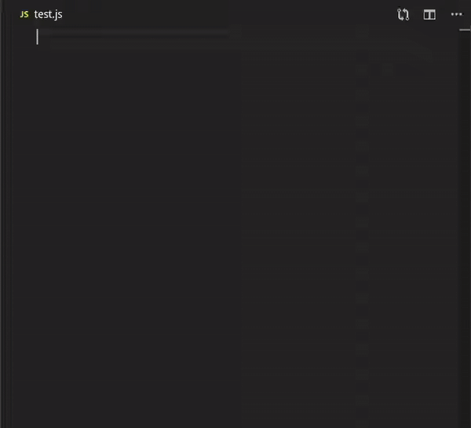

# Mongo Snippets

> vscode-id: [roerohan.mongo-snippets-for-node-js](https://marketplace.visualstudio.com/items?itemName=roerohan.mongo-snippets-for-node-js)

This Visual Studio Code extension is built for Node-js projects. It provides:
- **Code Snippets** for MongoDB Connection and queries.
- Command Palette Feature to **Set up Boilerplate Code**.
- **Completion Suggestions** for Mongoose Models.
- **Mongo Connect** directly from the editor.



## Table of Contents:

- [Features](#features)
- [Requirements](#requirements)
- [Issues](#issues)
- [User's Notes](#user's-notes)
- [Release Notes](#release-notes)
- [Contributing](#contributing)
- [License](#license)
- [More information](#for-more-information)

## Features

### **Command Palette:**

> Note: Ctrl+Shift+P or Command+Shift+P opens Command Palette in VSCode.

- **Mongo Snippets: Refer to Mongoose Documentation**
   * Opens the [Mongoose Documentation](https://mongoosejs.com/docs/api.html#Model) on a web browser.

- **Mongo Snippets: Refer to Extension Documentation**
   * Opens the [Repository](https://github.com/roerohan/vscode-MongoSnippets-NodeJS) on a web browser.

- **Mongo Snippets: Set up Mongo Boilerplate Code**
   * Creates folders named `routes` and `models` - if they do not exist - in the [`source directory`](#source-directory), and adds files containing boilerplate code.

- **Mongo Snippets: Show Existing Models**
   * Shows a list of names of models present in the `models` folder in the [`source directory`](#source-directory).
   * Highlights the model definition in the file where it had been created.

- **Mongo Snippets: View MongoDB Collection as JSON**
> Note: This is a beta feature and will be receive updates soon.
   * Connect to a MongoDB instance using a connection string and view a DB as a JSON.

### **Completion Suggestions:**

> Note: See User's Notes for details.

- Model name suggestions:
   * First it identifies the names of the models in a folder named models (if any) in the [`source directory`](#source-directory).
   * It stores the model and field names and provides completion suggestions when you type.
   * Suggests field names for models. E.G. if the model `User` has a field `name`, on typing `User.`, `name` is suggested.
   * Field names are also suggested inside `{...}`.

### **Snippets:**

The following are some of the snippets that can be generated with this extension.

> Note: Type the following snippets and press 'Tab' OR 'Ctrl/Command + Space; Enter' for auto-completion.

|       **Type/No.**       |   **Snippet**  |        **Stands For**       |          **Function**          |
|:------------------------:|:--------------:|:---------------------------:|:------------------------------:|
|       **Generic:**       |                |                             |                                |
|            1.            |    **!mdbc**   |       MongoDB Connect       |  MongoDB connect on port 27017 |
|            2.            |   **!mdbgum**  | MongoDB Generate User Model |   Generate typical user model  |
|            3.            |    **!mdba**   |      MongoDB Aggregate      |     *Model.aggregate* query    |
|            4.            |   **!mdbcd**   |    MongoDB CountDocuments   |  *Model.countDocuments* query  |
|            5.            |   **!mdbmr**   |      MongoDB MapReduce      |     *Model.mapReduce* query    |
|            6.            |    **!mdbp**   |       MongoDB Populate      |     *Model.populate* query     |
|            7.            |   **!mdbbw**   |      MongoDB BulkWrite      |     *Model.bulkWrite* query    |
|    **Create/Insert:**    |                |                             |                                |
|            1.            |   **!mdbcr**   |        MongoDB Create       |      *Model.create* query      |
|            2.            |   **!mdbcc**   |   MongoDB CreateCollection  | *Model.createCollection* query |
|            3.            |   **!mdbim**   |      MongoDB InsertMany     |    *Model.insertMany* query    |
|         **Find:**        |                |                             |                                |
|            1.            |    **!mdbf**   |         MongoDB Find        |       *Model.find* query       |
|            2.            |   **!mdbfo**   |       MongoDB FindOne       |      *Model.findOne* query     |
|            3.            |   **!mdbfbi**  |       MongoDB FindById      |     *Model.findById* query     |
|        **Update:**       |                |                             |                                |
|            1.            |  **!mdbfoau**  |   MongoDB FindOneAndUpdate  | *Model.findOneAndUpdate* query |
|            2.            |   **!mdbuo**   |      MongoDB UpdateOne      |     *Model.updateOne* query    |
|            3.            |   **!mdbum**   |      MongoDB UpdateMany     |    *Model.updateMany* query    |
|        **Delete:**       |                |                             |                                |
|            1.            |  **!mdbfoad**  |   MongoDB FindOneAndDelete  | *Model.findOneAndDelete* query |
|            2.            |   **!mdbdo**   |      MongoDB DeleteOne      |     *Model.deleteOne* query    |
|            3.            |   **!mdbdm**   |      MongoDB DeleteMany     |    *Model.deleteMany* query    |
| **Methods and Statics:** |                |                             |                                |
|            1.            | **!mdbmethod** |       MongoDB Methods       |    *schema.methods.function*   |
|            2.            | **!mdbstatic** |       MongoDB Statics       |    *schema.statics.function*   |


## Requirements

> There are no dependencies for this extension to work, but it provides mongoose-js snippets, hence mongoose should be installed.

- mongoose library from npm.
This can be installed by executing the following command in the folder where 'package.json' is present.
```bash
npm install mongoose
```
> Make sure mongoose is added as a dependency in package.json

## Issues

Please report issues on [vscode-MongoSnippets-NodeJS](https://github.com/roerohan/vscode-MongoSnippets-NodeJS/issues).

## User's Notes

### Source Directory

- The source directory, as mentioned multiple times, is by default the root directory of your workspace. It can be modified by adding the following to `.vscode/settings.json` in your workspace root directory.

```json
{
   "mongosnippets": {
      "sourceDir": "src"
   }
}
```

- The above line changes the `source directory` from the root directory of the workspace to a folder named `src` in the root directory.

### Other

- The boilerplate is set up in the `source directory` of the workspace. In order to set up the boilerplate code in a certain directory, that directory must be open in a new workspace. (Open the folder you want the boilerplate code in with VSCode).

- Model name suggestions are only given for those models defined in files present in a directory called `models` in the `source directory` of the workspace. Folders with other names are not checked, hence models defined in them will not show up as suggestions.

- In files where models are described, to be able to detect the models, mongoose must be imported as `mongoose` only. For example,
   * const mongoose = require('mongoose');
   * import mongoose from 'mongoose';

- The model must be created in the models folder as follows:
   * const modelName = mongoose.model('modelName', modelSchema)

- Mongo Snippets: See Existing Models command shows models only in the `source directory` of the workspace.

- For field name suggestions, each model should be exported in a seperate file, and the file should not have errors.

## Release Notes

These are the release notes for mongo-snippets-for-node-js.

### v1.3.1

- Fix:
   * CompletionItemProvider code optimization.
   * General working of the extension.

### v1.3.0

- Feat:
   * Get `sourceDir` from `.vscode/settings.json` under key `mongosnippets`.

- Fix:
   * Set up boilerplate, make folders awaited.

### v1.2.5

- Refactor:
   * Lots of code refactor, remove lint warnings and errors.
   * Code quality improvements.

- Feat:
   * Code should run faster now.
   * Should take lesser processing power.
   * Typescript support for existing features.

-----------------------------------------------------------------------------------------------------------

## Contributing

You can contribute to mongo-snippets-for-node-js on the GitHub page [vscode-MongoSnippets-NodeJS](https://github.com/roerohan/vscode-MongoSnippets-NodeJS). Checkout [CONTRIBUTING.md](https://github.com/roerohan/vscode-MongoSnippets-NodeJS/blob/master/CONTRIBUTING.md) for further details.

## License

Click the following hyperlink to view the license.
* [MIT License](https://github.com/roerohan/vscode-MongoSnippets-NodeJS/blob/master/LICENSE)

### For more information

You can checkout the source code and contribute on:

* [vscode-MongoSnippets-NodeJS](https://github.com/roerohan/vscode-MongoSnippets-NodeJS)

**Enjoy!**
